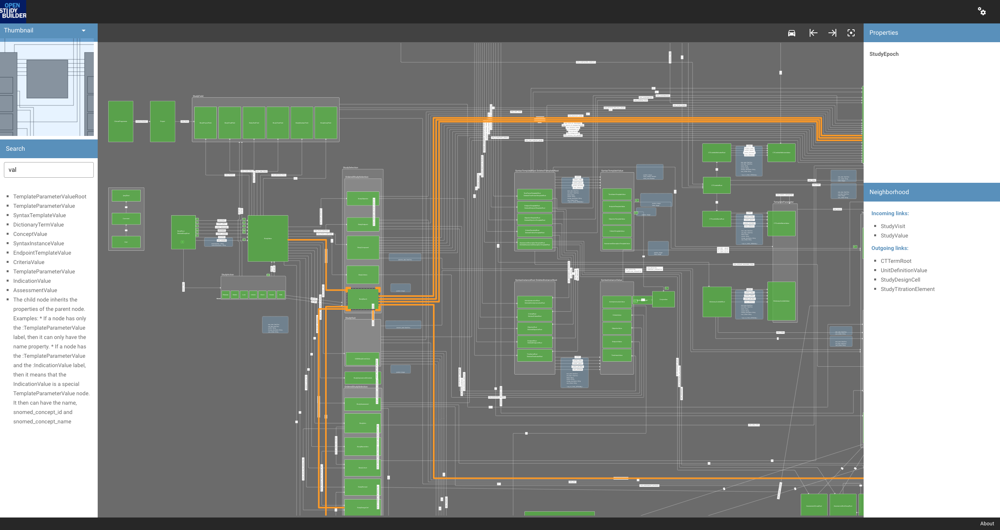

# Schema Visualizer

Visualizes GraphML output from yEd. 


You will need [a (trial) license of yFiles](https://www.yworks.com/downloads) to run the application. Put the `yfiles-23.0.4.tgz` somewhere in the root of the solution or update the `package.json` 

```json
{
  "dependencies": {

    "yfiles": "./yfiles-23.0.4.tgz"

  }
}
```

Thereafter run `npm i` and `npm start` as usual. Via the menu a GraphML file can be selected and visualized.
There is a sample GraphML file in the `public` directory.
